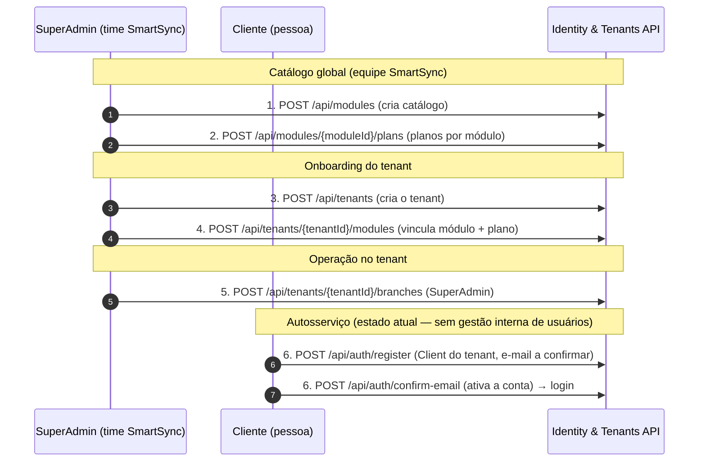

# Fluxo de Cadastro — Ordem Oficial das Entidades

> **Compatível com a Etapa 15/16/17/18.** A ordem abaixo é a **única sequência
> suportada** pelo serviço Identity & Tenants. Pular um passo gera erro (FKs e
> regras de negócio impedem) ou deixa o tenant inutilizável (sem módulos não há
> acesso a produto).
> **Fonte da verdade técnica:** OpenAPI/Scalar em
> [http://localhost:8080/scalar/v1](http://localhost:8080/scalar/v1).

---

## Quem faz cada passo

| Passo | Executado por | Onde |
|-------|---------------|------|
| 1. Módulos | Equipe **SmartSync** (SuperAdmin) | Catálogo global |
| 2. Planos por módulo | Equipe **SmartSync** (SuperAdmin) | Catálogo global |
| 3. Tenant | SuperAdmin | Operação de onboarding |
| 4. Vínculo Tenant↔Módulo (+plano) | SuperAdmin (contratação/billing) | Operação de onboarding |
| 5. Filiais | SuperAdmin **ou** TenantAdmin do próprio tenant | Operação no tenant |
| 6. Usuários | **Público** — hoje só Client autosserviço via `POST /api/auth/register` | Autosserviço no tenant |

> **TenantAdmin** só enxerga/opera o **próprio tenant** (autorização por claim
> `tenant_id` do JWT — Etapa 14). **Módulos, planos e vínculos** são
> exclusivos de **SuperAdmin** (Etapa 15).
>
> **Estado atual do Passo 6 (importante):** a gestão de usuários **internos**
> (criar TenantAdmin/Manager/Seller/Delivery via API) ainda **não existe** —
> é pendência registrada (Etapa 11/16). O único registro via API é o **Client
> autosserviço**, público.

---

## Diagrama da sequência



> **Nota:** gestão de usuários internos (TenantAdmin/Manager/Seller/Delivery)
> via API é **pendência**; hoje só existe o Client autosserviço.

Sequência equivalente em texto:

```
Module → Plan (por Module) → Tenant → Vínculo Tenant-Module (+Plan) → Branch → Usuários
```

---

## Passo 1 — Cadastrar o catálogo de **Modules**

**Endpoint:** `POST /api/modules` — **SuperAdmin** (equipe SmartSync).
**Scalar:** [POST /api/modules](http://localhost:8080/scalar/v1#tag/Modules)

- Módulo é um **produto/serviço da plataforma** (ex.: `SmartSync Agro`,
  `SmartSync E-Commerce`, `SmartSync Agenda`).
- É cadastrado pela **equipe SmartSync**, **não pelo Tenant** — o tenant apenas
  **contrata** módulos prontos do catálogo.
- O `slug` é o **identificador estável** usado pelos demais microsserviços
  (ex.: `agro`). Por isso é **imutável** depois da criação — PUT muda apenas
  `name`/`description`.
- **Por que precisa existir antes dos Plans:** todo `Plan` pertence a **um**
  único módulo (`plans.module_id` é obrigatório — Etapa 15). Sem o módulo no
  catálogo não existe onde ancorar o plano.

```json
POST /api/modules
{
  "name": "SmartSync Agro",
  "slug": "agro",
  "description": "Gestão de propriedades rurais"
}
```

Resposta `201` → `ModuleDto` (`id`, `name`, `slug`, `description`, ...).

---

## Passo 2 — Cadastrar os **Plans** de cada **Module**

**Endpoint:** `POST /api/modules/{moduleId}/plans` — **SuperAdmin**.
**Scalar:** [POST /api/modules/{moduleId}/plans](http://localhost:8080/scalar/v1#tag/Plans)

- **Regra da Etapa 15:** todo Plano pertence a **um único** Módulo. O
  `{moduleId}` vem da rota; não existe plano "global".
- O **nome do plano é único por módulo** (o mesmo nome pode existir em módulos
  diferentes — ex.: `Essencial` no Agro e `Essencial` no E-Commerce).
- O `ModuleId` precisa existir e estar ativo (`404` caso contrário).

```json
POST /api/modules/{moduleId}/plans
{
  "name": "Essencial",
  "description": "Plano inicial",
  "monthlyPrice": 49.90,
  "annualPrice": 499.00,
  "trialDays": 7,
  "features": ["Dashboard", "Relatórios"],
  "maxBranches": 5,
  "maxUsers": 10,
  "maxStorageMb": 1024
}
```

Resposta `201` → `PlanDto` (com `moduleId`).

---

## Passo 3 — Cadastrar o **Tenant**

**Endpoint:** `POST /api/tenants` — **SuperAdmin**.
**Scalar:** [POST /api/tenants](http://localhost:8080/scalar/v1#tag/Tenants)

- O tenant nasce **sem módulos/planos** (mudança da Etapa 15) — a contratação é
  feita no **Passo 4**.
- O tenant pode ser **pessoa física ou jurídica** (Etapa 17): `tipoPessoa` é um
  **enum numérico** (`1` = Fisica, `2` = Juridica) — a API **não aceita**
  `"Fisica"/"Juridica"` como string (400); + `documento` (CPF 11 / CNPJ 14
  dígitos, validados).
- Documento e e-mail são **únicos globais** (Etapa 04/13); o documento é
  imutável depois.

```json
POST /api/tenants
{
  "legalName": "Fazenda Boa Vista LTDA",
  "tradeName": "Boa Vista",
  "tipoPessoa": 2,
  "documento": "11222333000181",
  "email": "contato@boavista.com.br"
}
```

Pessoa física: `"tipoPessoa": 1, "documento": "12345678909"`.

> **Atualização (validado ao vivo):** o schema OpenAPI confirma `TipoPessoa` como
> `integer`. Se preferir strings na API (`"fisica"`/`"juridica"`), seria preciso
> registrar um `JsonStringEnumConverter` no `Program.cs` — melhoria futura
> opcional.

Resposta `201` → `TenantDto` (sem `planId` — removido na Etapa 15).

---

## Passo 4 — Vincular o **Tenant** aos **Modules** contratados (escolhendo o **Plan**)

**Endpoints (SuperAdmin):**

| Ação | Rota | Scalar |
|------|------|--------|
| Vincular (contratar) | `POST /api/tenants/{tenantId}/modules` | [POST …/modules](http://localhost:8080/scalar/v1#tag/Tenant-Modules) |
| Trocar plano (upgrade/downgrade) | `PUT /api/tenants/{tenantId}/modules/{moduleId}` | [PUT …/modules/{moduleId}](http://localhost:8080/scalar/v1#tag/Tenant-Modules) |
| Desvincular (encerrar) | `DELETE /api/tenants/{tenantId}/modules/{moduleId}` | [DELETE …/modules/{moduleId}](http://localhost:8080/scalar/v1#tag/Tenant-Modules) |
| Listar vínculos | `GET /api/tenants/{tenantId}/modules` | [GET …/modules](http://localhost:8080/scalar/v1#tag/Tenant-Modules) |

- O tenant contrata **um ou mais módulos**, escolhendo o plano **de cada**
  módulo. **É esperado e normal ter planos diferentes por módulo** — ex.:
  `Essencial` no Agro e `Pro` no E-Commerce — cada módulo tem seu próprio
  catálogo.
- O `planId` informado **precisa ser do módulo** que está sendo vinculado
  (`400` caso contrário). Plano e módulo precisam estar ativos.
- **Regra central:** no máximo **um vínculo ativo** por (tenant, módulo).
- **Trocar plano** (`PUT`) não apaga o histórico: a vigência atual é encerrada
  (`endDateUtc`) e uma nova é criada — útil para billing. Mesmo plano =
  idempotente. Sem vínculo ativo = reativa/cria.
- **Desvincular** (`DELETE`) encerra a vigência ativa e preserva o histórico.
- Listagem padrão traz só vínculos **ativos**; `?includeInactive=true` traz o
  histórico completo.

```json
POST /api/tenants/{tenantId}/modules
{
  "moduleId": "<id-do-module-agro>",
  "planId": "<id-do-plano-essencial-do-agro>"
}
```

Resposta `201` → `TenantModuleDto` com `moduleName` resolvido (o plano é
referenciado apenas por `planId` — FK; o nome vem da tabela de planos):

```json
{
  "id": "...",
  "tenantId": "...",
  "moduleId": "...",
  "moduleName": "SmartSync Agro",
  "planId": "...",
  "status": 1,
  "startDateUtc": "2026-08-09T22:40:00Z",
  "endDateUtc": null,
  "createdAtUtc": "2026-08-09T22:40:00Z"
}
```

---

## Passo 5 — Cadastrar as **Filiais (Branches)** do Tenant

**Endpoint:** `POST /api/tenants/{tenantId}/branches` — **SuperAdmin** (qualquer
tenant) **ou TenantAdmin** (apenas o próprio tenant — a rota deve bater com a
claim `tenant_id`, senão `403`).
**Scalar:** [POST /api/tenants/{tenantId}/branches](http://localhost:8080/scalar/v1#tag/Branches)

- Sempre aninhadas ao tenant (Etapa 14); a listagem/detalhe **nunca vazam**
  filiais de outro tenant.
- Telefone (10/11 dígitos), CEP (8 dígitos) e UF (2 letras) validados no
  contrato (VOs `Contact`/`Address`).

```json
POST /api/tenants/{tenantId}/branches
{
  "name": "Filial Centro",
  "address": {
    "street": "Rua das Flores",
    "number": "123",
    "complement": "Sala 2",
    "district": "Centro",
    "city": "São Paulo",
    "state": "SP",
    "postalCode": "01310100"
  },
  "contact": {
    "phone": "11999991234",
    "secondaryPhone": null,
    "email": "filial.centro@boavista.com.br"
  }
}
```

> Campos de API: `address` usa **`district`** (bairro) e **`postalCode`**; o
> `contact` usa **`secondaryPhone`** (não `phone2`).

---

## Passo 6 — Usuários do Tenant (hoje: **Client** autosserviço)

**Endpoint:** `POST /api/auth/register` — **Público** (autosserviço).
**Scalar:** [POST /api/auth/register](http://localhost:8080/scalar/v1#tag/Auth)

> **Estado atual:** o registro via API cria **sempre um Client** (não há campo
> `type`). A gestão de usuários internos do tenant (TenantAdmin/Manager/Seller/
> Delivery) pela API é **pendência** — registrada na memória (Etapa 11/16). Até
> lá, esses usuários são criados por seed/infraestrutura.

### 6. Client autosserviço

- **`POST /api/auth/register`** é **público** e cria um Client vinculado ao
  tenant:
  - `tenantId` é **obrigatório** (o usuário trabalha no tenant);
  - a conta nasce com **e-mail NÃO confirmado** — só loga após confirmar o link
    (`POST /api/auth/confirm-email`);
  - `document` (CPF) e `email` únicos **por tenant** (Etapa 04).

```json
POST /api/auth/register
{
  "fullName": "Carlos Cliente",
  "email": "carlos@boavista.com.br",
  "password": "Senha!2026x",
  "tenantId": "<id-do-tenant>",
  "document": "98765432100"
}
```

Resposta `201` → `{ "title": "Conta criada. Confirme o e-mail para ativar." }`
(o link de confirmação é enviado por e-mail).

> **Client via SSO (Etapa 05):** além do registro local, o Client pode entrar por
> Google/Facebook iniciando em
> `GET /api/auth/external-login/{provider}?tenantId=<id>` (o callback é
> `GET /api/auth/external-login-callback`).

> **Pendência (futuro Passo 6b):** endpoints de administração para criar os
> usuários internos do tenant (`type=tenantadmin|manager|seller|delivery`) com
> `tenantId` — registrado na memória (Etapa 11/16), **não implementado**.

---

## Checklist resumido

- [ ] Módulos do catálogo criados (SuperAdmin) — `core` já existe no seed
- [ ] Planos de cada módulo criados (SuperAdmin) — `Full Access` já existe no seed
- [ ] Tenant criado (SuperAdmin)
- [ ] Tenant vinculado aos módulos contratados com plano por módulo (SuperAdmin)
- [ ] Filiais do tenant cadastradas (SuperAdmin ou TenantAdmin do tenant)
- [ ] Client do tenant cadastrado via `POST /api/auth/register` e e-mail confirmado
- [ ] (Pendência) Usuários internos do tenant (TenantAdmin/Manager/Seller/Delivery) via API — **não implementado**

## Consulta dos módulos de um tenant pelos demais microsserviços

> **Pendência de implementação** (Etapa 16). Enquanto o endpoint dedicado não
> existir, os demais microsserviços **não devem** consultar o banco do Identity
> diretamente. O contrato recomendado está documentado em
> [CONTRATO-IDENTIDADE.md](CONTRATO-IDENTIDADE.md#consulta-de-módulos-pelos-demais-microsserviços)
> — seção que define o contrato planejado `GET /api/tenants/me/modules`.
