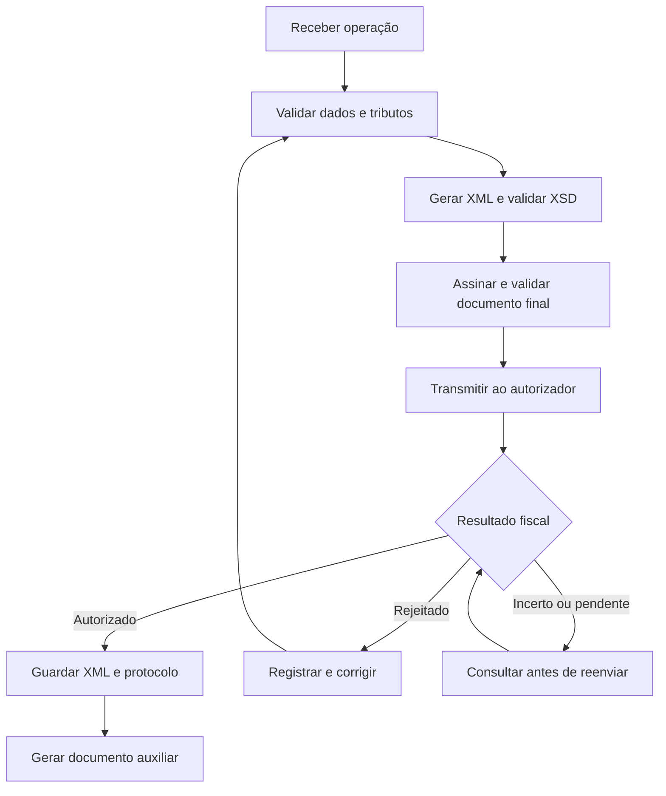

# Material-base — fundamentos fiscais e roteiro de implementação de backend

> Origem: conteúdo colado pelo usuário em 19/09/2026 como resposta à pendência P1 da Etapa 1.
> Referência da conversa original: 19/09/2026.
> Natureza: **material didático, não um emissor fiscal pronto nem parecer tributário**. Exemplos parciais de código não foram compilados como solução completa. Antes de integrar serviços reais, confirmar legislação, credenciamento, schemas, Notas Técnicas e endpoints oficiais.
> Este arquivo preserva o conteúdo para confronto nas Etapas 2+. Não replicar snippets literalmente na implementação (regra do prompt mestre).

**Curso:** Desenvolvimento de Sistemas

**Material:** fundamentos fiscais e roteiro de implementação de backend

**Referência da conversa original:** 19/09/2026

> Material didático, não um emissor fiscal pronto nem parecer tributário. Esta versão organiza o conteúdo da conversa para uso em aula; não representa uma nova verificação integral das normas vigentes. Antes de integrar serviços reais, confirme legislação, credenciamento, schemas, Notas Técnicas e endpoints oficiais. Exemplos parciais de código não foram compilados como uma solução completa.

## Objetivos da aula

- Diferenciar NF-e, CT-e e NFS-e.
- Entender certificado digital, XML, XSD, SOAP e autorização fiscal.
- Organizar uma API ASP.NET Core 10 em camadas.
- Planejar emissão, consulta, cancelamento e armazenamento.
- Compreender concorrência, idempotência e segurança.
- Desenvolver primeiro um simulador e depois uma integração de homologação.

## 1. Primeiro: não confundir os documentos

| Documento | Modelo | Finalidade | Responsável pela autorização |
| --- | --- | --- | --- |
| NF-e | 55 | Operações com mercadorias | SEFAZ/autorizador competente |
| NFC-e | 65 | Operações de varejo abrangidas por suas regras | SEFAZ/autorizador competente |
| CT-e | 57 | Prestação de transporte de cargas abrangida pelo documento | SEFAZ/autorizador competente |
| CT-e OS | 67 | Outros serviços de transporte abrangidos pelo documento | SEFAZ/autorizador competente |
| NFS-e | Padrão municipal ou nacional | Serviços sujeitos às regras da NFS-e | Município/sistema nacional aplicável |
| DANFE/DACTE | Não se aplica | Documento auxiliar da NF-e/CT-e | Gerado pelo sistema emissor |

A associação didática inicial é: mercadorias → NF-e; transporte de cargas → CT-e; demais serviços abrangidos → NFS-e. A escolha efetiva depende da operação e da legislação; nem todo transporte utiliza CT-e.

**A NFS-e não é uma NF-e de serviços autorizada pela SEFAZ-SP.** Identifique o município e o sistema aplicável ao contribuinte. Estado de São Paulo e Município de São Paulo são autoridades diferentes.

## 2. Requisitos gerais para emissão

### 2.1 NF-e em São Paulo

Verificar, conforme o enquadramento do emitente:

1. CNPJ e situação cadastral.
2. Inscrição Estadual e regularidade exigida.
3. Credenciamento como emissor.
4. Certificado digital aceito pelo projeto.
5. Sistema compatível com o leiaute e as regras vigentes.
6. Cadastro fiscal dos produtos e operações.
7. Configuração e testes em homologação.
8. Habilitação e configuração para produção.

A integração envolve XML oficial, assinatura digital, HTTPS, serviços SOAP, schemas XSD, regras fiscais e protocolo. Consulte a relação oficial de serviços da NF-e.

### 2.2 CT-e

Verificar cadastro do transportador, habilitação/credenciamento, certificado, documentos vinculados, tomador, remetente, destinatário, percurso, carga, valores e dados específicos do modal. Nem todos os dados de veículo ou viagem pertencem necessariamente ao CT-e: há informações e obrigações próprias do MDF-e.

O CT-e possui contratos e serviços próprios. Não reutilize automaticamente o fluxo de lotes/recibos da NF-e: o processamento depende da versão e do serviço do CT-e. Consulte o Portal Nacional do CT-e.

### 2.3 NFS-e

Antes de programar, responda: **qual município e qual sistema o contribuinte deve utilizar?**

Podem existir sistema municipal próprio, provedor terceirizado ou serviços do padrão nacional. Os contratos podem envolver SOAP/XML, REST, RPS, DPS, certificados ou outras credenciais previstas pelo serviço.

Não confunda adesão/compartilhamento de dados no padrão nacional com disponibilidade universal do mesmo endpoint de emissão para qualquer contribuinte. Confirme o caso concreto. Para MEI, consulte as orientações oficiais de NFS-e.

## 3. Certificado digital

| Tipo | Característica | Consideração para backend |
| --- | --- | --- |
| A1 | Arquivo, geralmente PFX/P12 | Integração usualmente mais simples em servidor |
| A3 | Dispositivo/provedor criptográfico | Exige acesso e infraestrutura compatíveis |
| Em nuvem | Chave operada por serviço remoto | Depende da integração e aceitação aplicáveis |

Cuidados essenciais:

- Não colocar PFX, senha ou chave privada no Git.
- Usar um cofre de segredos em produção.
- Restringir permissões de acesso ao certificado.
- Monitorar validade e planejar renovação.
- Não registrar senhas nem XMLs completos indiscriminadamente nos logs.
- Validar a identidade do emitente e a permissão de uso do certificado.

A assinatura XML e a autenticação TLS com certificado são funções diferentes. Configurar o certificado no `HttpClient` não assina o XML.

## 4. Fluxo simplificado de emissão



No fluxo normal, gerar ou assinar um XML não significa obter autorização fiscal. Contingência possui regras próprias e não deve ser improvisada.

Se o diagrama não renderizar no destino, use a sequência: receber → validar → gerar XML → assinar → transmitir → interpretar → armazenar/consultar/corrigir.

## 5. Regras importantes para os alunos

### 5.1 Numeração e série

Controle emitente/estabelecimento, modelo, série, número e ambiente. Evite usar apenas:

```csharp
var numero = ultimoNumero + 1;
```

Dois pedidos simultâneos podem receber o mesmo número. Use transação e mecanismo de concorrência no banco, além de restrição única compatível com a identidade fiscal.

### 5.2 Chave de acesso

Na NF-e e no CT-e, a chave tradicional possui 44 posições e combina campos definidos pelo leiaute: UF, período, identificação do emitente, modelo, série, número, tipo de emissão, código numérico e dígito verificador.

Um GUID pode identificar o registro interno, mas não substitui a chave fiscal. Não derive toda a validação de identificadores de exemplos antigos: mudanças de leiaute e identificação devem ser acompanhadas.

### 5.3 Homologação

- Não possui validade fiscal de produção.
- Usa endpoints e identificação de ambiente próprios.
- Exige dados e textos de teste previstos pelo projeto.
- Não é um ambiente anônimo: pode exigir certificado e habilitação.
- Não misture configuração de produção com XML de homologação.

### 5.4 Cancelamento

É um evento sujeito a condições, prazo e justificativa. O sistema deve conservar documento, pedido e protocolo do evento. Cancelar não significa apagar uma linha do banco.

Não há um prazo único que possa ser aplicado indistintamente a NF-e, CT-e e NFS-e. Confirme as regras de cada documento e autorizador.

### 5.5 Inutilização

Na NF-e, a inutilização trata de numeração não utilizada, conforme condições e prazos aplicáveis. Exemplo: números 100 e 102 utilizados e 101 não utilizado. Não é cancelamento e não deve ser generalizada automaticamente para CT-e ou NFS-e.

### 5.6 Contingência

Indisponibilidade não autoriza inventar um modo offline. Cada modalidade tem condições de uso, tipo de emissão, impressão e transmissão posterior. Implemente apenas a modalidade prevista para o documento e para o cenário.

### 5.7 Armazenamento

Conserve XML transmitido, XML autorizado/protocolado, eventos e respostas relevantes pelo prazo legal aplicável. Inclua backup, controle de acesso e auditoria. O PDF do DANFE não substitui o XML fiscal autorizado.

## 6. Emissão em lote

### NF-e

Um lote é um envelope de transporte; seus documentos continuam independentes. Cada NF-e tem chave e resultado próprios. Uma pode ser autorizada e outra rejeitada.

- Enviar em lote não transforma várias vendas em uma única nota.
- Respeite limites e processamento previstos na versão vigente.
- Diferencie resposta do lote e resultado de cada documento.
- Consulte recibo quando o serviço retornar processamento assíncrono.
- Não suponha que todo envio usa recibo: o fluxo síncrono possui retorno próprio.

### CT-e Simplificado

É uma modalidade fiscal específica, não um nome alternativo para envio em lote. A documentação citada na conversa descreve condições envolvendo múltiplos remetentes/destinatários e um tomador, serviço próprio e processamento síncrono com mensagem compactada. Confirme a versão vigente antes de implementar.

Referência: documentação do CT-e Simplificado.

## 7. Reforma tributária e atualização técnica

Os projetos fiscais têm recebido alterações relacionadas a IBS/CBS, classificações tributárias, totais e validações. Um exemplo antigo que usa a versão nominal “4.00” pode estar incompatível com schemas e regras mais recentes.

Antes de cada implantação, conferir:

1. Manual do documento.
2. Pacote de schemas XSD.
3. Notas Técnicas e suas revisões.
4. Tabelas e classificações.
5. Cronograma por ambiente e regra.
6. Endpoints oficiais.
7. Enquadramento tributário do emitente/operação.

Publicação de uma Nota Técnica não significa que todas as suas regras já estejam obrigatórias para todos os contribuintes. Não fixe alíquotas e regras por suposição. Referência histórica citada: adequações de IBS/CBS no CT-e.

## 8. Arquitetura recomendada

| Projeto | Responsabilidade | Componentes sugeridos |
| --- | --- | --- |
| Fiscal.Api | Entrada HTTP e autenticação | Controllers, tratamento de erros |
| Fiscal.Application | Casos de uso | DTOs, serviços, contratos de integração |
| Fiscal.Domain | Modelo de negócio | Entidades, estados, regras |
| Fiscal.Infrastructure | Implementações externas | Banco, certificado, clientes NF-e/CT-e/NFS-e, schemas |

Contrato conceitual:

```csharp
public interface IDocumentoFiscalService
{
    Task<ResultadoFiscal> EmitirAsync(
        Guid documentoId,
        CancellationToken cancellationToken);
}
```

`ResultadoFiscal` é um tipo a implementar. Separe os contratos especializados quando os documentos exigirem dados e operações diferentes. Evite uma única classe gigante para todos os autorizadores.

## 9. Criando o projeto ASP.NET Core 10

### 9.1 Solução e projetos

Pré-requisito: SDK .NET 10 instalado. Execute em uma pasta nova.

```bash
mkdir FiscalBackend
cd FiscalBackend
dotnet new sln -n FiscalBackend
dotnet new webapi -n Fiscal.Api -f net10.0 --use-controllers
dotnet new classlib -n Fiscal.Domain -f net10.0
dotnet new classlib -n Fiscal.Application -f net10.0
dotnet new classlib -n Fiscal.Infrastructure -f net10.0

dotnet sln add Fiscal.Api/Fiscal.Api.csproj
dotnet sln add Fiscal.Domain/Fiscal.Domain.csproj
dotnet sln add Fiscal.Application/Fiscal.Application.csproj
dotnet sln add Fiscal.Infrastructure/Fiscal.Infrastructure.csproj

dotnet add Fiscal.Application/Fiscal.Application.csproj reference Fiscal.Domain/Fiscal.Domain.csproj
dotnet add Fiscal.Infrastructure/Fiscal.Infrastructure.csproj reference Fiscal.Domain/Fiscal.Domain.csproj
dotnet add Fiscal.Infrastructure/Fiscal.Infrastructure.csproj reference Fiscal.Application/Fiscal.Application.csproj
dotnet add Fiscal.Api/Fiscal.Api.csproj reference Fiscal.Application/Fiscal.Application.csproj
dotnet add Fiscal.Api/Fiscal.Api.csproj reference Fiscal.Infrastructure/Fiscal.Infrastructure.csproj
```

O uso de `--use-controllers` alinha o projeto ao exemplo de Controller desta aula.

### 9.2 Pacotes

```bash
dotnet add Fiscal.Infrastructure/Fiscal.Infrastructure.csproj package Microsoft.EntityFrameworkCore --version 10.*
dotnet add Fiscal.Infrastructure/Fiscal.Infrastructure.csproj package Microsoft.EntityFrameworkCore.Design --version 10.*
dotnet add Fiscal.Infrastructure/Fiscal.Infrastructure.csproj package Microsoft.EntityFrameworkCore.SqlServer --version 10.*
dotnet add Fiscal.Infrastructure/Fiscal.Infrastructure.csproj package System.Security.Cryptography.Xml --version 10.*
```

Para um projeto reproduzível, depois de selecionar e testar uma versão 10.x compatível, fixe a versão exata no projeto. Pacotes de integração/configuração também podem ser necessários conforme a distribuição das classes.

PDF, QR Code, mensageria e resiliência são extensões possíveis. Uma biblioteca fiscal precisa ser avaliada quanto a manutenção, licença, plataformas e suporte às Notas Técnicas aplicáveis.

## 10. Configuração segura

Exemplo de `appsettings.json`, sem credenciais reais:

```json
{
  "Fiscal": {
    "Ambiente": "Homologacao",
    "Uf": "SP",
    "Certificado": {
      "Caminho": "",
      "Senha": ""
    },
    "NFe": {
      "VersaoLayout": "4.00",
      "UrlAutorizacao": ""
    }
  }
}
```

Chaves de configuração que podem ser fornecidas pelo ambiente:

```
Fiscal__Certificado__Caminho
Fiscal__Certificado__Senha
Fiscal__NFe__UrlAutorizacao
```

Em desenvolvimento, use segredos de usuário; em produção, um mecanismo protegido de segredos. Nunca aceite do cliente HTTP uma URL arbitrária para envio do certificado.

```csharp
public sealed class FiscalOptions
{
    public string Ambiente { get; init; } = "Homologacao";
    public string Uf { get; init; } = "SP";
    public CertificadoOptions Certificado { get; init; } = new();
    public NFeOptions NFe { get; init; } = new();
}

public sealed class CertificadoOptions
{
    public string Caminho { get; init; } = string.Empty;
    public string Senha { get; init; } = string.Empty;
}

public sealed class NFeOptions
{
    public string VersaoLayout { get; init; } = "4.00";
    public string UrlAutorizacao { get; init; } = "string.Empty";
}
```

> Nota de confronto com o repo (Etapa 1, sem alterar código): o trecho acima usa `= "string.Empty"` como literal no material; em C# o correto seria `= string.Empty`. Não replicar literalmente. Também `Microsoft.EntityFrameworkCore.SqlServer` no §9.2 conflita com o padrão real do repo (PostgreSQL/Npgsql) e não será adotado sem necessidade demonstrada.

Trecho de registro no `Program.cs`:

```csharp
builder.Services.AddOptions<FiscalOptions>()
    .Bind(builder.Configuration.GetSection("Fiscal"))
    .Validate(o => o.Ambiente == "Homologacao",
        "Este laboratório permite apenas homologação.")
    .Validate(o => !string.IsNullOrWhiteSpace(o.Certificado.Caminho),
        "Informe o caminho do certificado.")
    .Validate(o => Uri.TryCreate(o.NFe.UrlAutorizacao,
        UriKind.Absolute, out var uri) && uri.Scheme == "https",
        "Informe um endpoint HTTPS oficial.")
    .ValidateOnStart();
```

A validação HTTPS não garante que o host seja oficial; use uma lista de endpoints confiáveis configurada pelo administrador. No simulador, não registre dependências de certificado nem exija endpoint real.

## 11. Carregando o certificado A1

```csharp
using System.Security.Cryptography.X509Certificates;
using Microsoft.Extensions.Options;

public sealed class CertificadoProvider
{
    private readonly FiscalOptions _options;

    public CertificadoProvider(IOptions<FiscalOptions> options)
    {
        _options = options.Value;
    }

    public X509Certificate2 Obter()
    {
        if (!File.Exists(_options.Certificado.Caminho))
            throw new InvalidOperationException("Certificado não encontrado.");

        var certificado = X509CertificateLoader.LoadPkcs12FromFile(
            _options.Certificado.Caminho,
            _options.Certificado.Senha,
            X509KeyStorageFlags.EphemeralKeySet);

        var agora = DateTime.UtcNow;
        if (!certificado.HasPrivateKey ||
            certificado.NotBefore.ToUniversalTime() > agora ||
            certificado.NotAfter.ToUniversalTime() <= agora)
        {
            certificado.Dispose();
            throw new InvalidOperationException(
                "Certificado sem chave privada ou fora da validade.");
        }

        return certificado;
    }
}
```

O consumidor deve administrar o ciclo de vida e descarte do certificado. Ainda são necessárias verificações de cadeia, uso permitido, identidade e políticas aplicáveis. `EphemeralKeySet` não elimina a necessidade de proteger o PFX de origem.

## 12. Cliente HTTPS com certificado

Trecho ilustrativo de registro:

```csharp
builder.Services.AddSingleton<CertificadoProvider>();

builder.Services.AddHttpClient("Sefaz", client =>
{
    client.Timeout = TimeSpan.FromSeconds(60);
})
.ConfigurePrimaryHttpMessageHandler(serviceProvider =>
{
    var provider = serviceProvider.GetRequiredService<CertificadoProvider>();
    var handler = new HttpClientHandler();
    handler.ClientCertificates.Add(provider.Obter());
    return handler;
});
```

Planeje descarte e renovação dos certificados associados aos handlers. Em sistema multiempresa, não compartilhe indiscriminadamente o certificado de um cliente com outro.

**Nunca desative a validação do certificado do servidor:**

```csharp
// INSEGURO — exemplo do que NÃO fazer:
handler.ServerCertificateCustomValidationCallback = (_, _, _, _) => true;
```

## 13. DTO de entrada e Controller

DTO didático incompleto: faltam endereços, regime, unidades, tributos, totais, pagamentos e demais campos exigidos pela operação.

```csharp
public sealed record EmitirNFeRequest(
    string PedidoId,
    string CnpjEmitente,
    string CpfCnpjDestinatario,
    string NomeDestinatario,
    IReadOnlyCollection<ItemNFeRequest> Itens);

public sealed record ItemNFeRequest(
    string Codigo,
    string Descricao,
    string Ncm,
    string Cfop,
    decimal Quantidade,
    decimal ValorUnitario);
```

O CNPJ recebido não concede permissão de emissão: a empresa deve ser resolvida/validada a partir do usuário autenticado. Valide quantidade, valores, códigos, arredondamento e regras fiscais no backend.

Exemplo parcial de Controller:

```csharp
using Microsoft.AspNetCore.Mvc;

[ApiController]
[Route("api/notas-fiscais")]
public sealed class NotasFiscaisController : ControllerBase
{
    private readonly INFeApplicationService _service;

    public NotasFiscaisController(INFeApplicationService service)
    {
        _service = service;
    }

    [HttpPost]
    public async Task<IActionResult> Emitir(
        EmitirNFeRequest request,
        CancellationToken cancellationToken)
    {
        var resultado = await _service.EmitirAsync(request, cancellationToken);
        return Ok(resultado);
    }
}
```

Esse exemplo aguarda o serviço. Para processamento durável em segundo plano, grave a solicitação, enfileire com segurança e retorne `202 Accepted` com URL de consulta. Não basta retornar `202` para criar processamento assíncrono.

No `Program.cs`, Controllers precisam de `builder.Services.AddControllers()` e `app.MapControllers()`. Registre também as implementações das interfaces quando existirem.

## 14. Serviço de emissão

O código abaixo é um esqueleto de orquestração. Entidades, interfaces, métodos e tipos de resultado precisam ser implementados; não é um arquivo independente compilável.

```csharp
public sealed class NFeApplicationService(
    INFeRepository repository,
    INFeXmlBuilder xmlBuilder,
    IXmlValidator validator,
    IXmlSigner signer,
    INFeSefazClient sefazClient) : INFeApplicationService
{
    public async Task<ResultadoEmissao> EmitirAsync(
        EmitirNFeRequest request,
        CancellationToken cancellationToken)
    {
        var existente = await repository.ObterPorPedidoAsync(
            request.PedidoId, cancellationToken);

        if (existente is not null)
            return ResultadoEmissao.De(existente);

        var nota = NFe.Criar(request);
        var xml = xmlBuilder.Criar(nota);
        // Validar a estrutura antes da assinatura conforme o schema aplicável.
        var xmlAssinado = signer.Assinar(xml);
        validator.Validar(xmlAssinado);

        // Persistir a intenção antes da chamada externa.
        nota.MarcarComoEnvioPendente(xmlAssinado);
        await repository.SalvarAsync(nota, cancellationToken);

        var resposta = await sefazClient.AutorizarAsync(
            xmlAssinado, cancellationToken);

        nota.ProcessarResposta(resposta);
        await repository.SalvarAsync(nota, cancellationToken);
        return ResultadoEmissao.De(nota);
    }
}
```

Pontos ainda necessários:

- Autenticação, autorização e isolamento por empresa.
- Reserva concorrente de número e chave idempotente.
- Tributação e chave de acesso.
- XML conforme schemas, assinatura e validação final.
- SOAP, namespaces, ação e eventuais compactações do serviço.
- Leitura do retorno por documento, recibo e consultas quando cabíveis.
- Conciliação após timeout ou falha de persistência.
- XML protocolado, eventos, contingência e auditoria.
- Worker/fila durável e outbox, se o processamento for desacoplado.

Uma transação no banco não inclui atomicamente a SEFAZ. Mesmo que a chamada retorne sucesso, a gravação local pode falhar: por isso a consulta e a conciliação são essenciais.

## 15. Validação por XSD

O fato de um XML abrir não significa que atende ao leiaute fiscal. Exemplo de validador com schemas locais confiáveis e bloqueio de DTD na mensagem recebida:

```csharp
using System.Xml;
using System.Xml.Schema;

public sealed class XmlSchemaValidator
{
    private readonly XmlSchemaSet _schemas;

    public XmlSchemaValidator(XmlSchemaSet schemas)
    {
        _schemas = schemas; // Precarregados do pacote oficial local.
    }

    public void Validar(string xml)
    {
        var erros = new List<string>();
        var settings = new XmlReaderSettings
        {
            DtdProcessing = DtdProcessing.Prohibit,
            XmlResolver = null,
            ValidationType = ValidationType.Schema,
            Schemas = _schemas,
            MaxCharactersInDocument = 5_000_000
        };

        settings.ValidationEventHandler += (_, evento) =>
            erros.Add(evento.Message);

        using var texto = new StringReader(xml);
        using var reader = XmlReader.Create(texto, settings);
        while (reader.Read()) { }

        if (erros.Count > 0)
            throw new InvalidOperationException(string.Join("\n", erros));
    }
}
```

O limite acima é uma proteção ilustrativa, não um limite oficial de lote. Carregue previamente as dependências XSD de modo controlado; não permita que XMLs enviados por usuários determinem downloads arbitrários de schemas. XSD não substitui cálculo fiscal nem validações de negócio do autorizador.

## 16. Assinatura XML

A assinatura deve referenciar o elemento/ID correto e estar na posição exigida. Abaixo, uma base didática para estudar `SignedXml`, não um assinador universal de documentos fiscais.

```csharp
using System.Security.Cryptography.Xml;
using System.Security.Cryptography.X509Certificates;
using System.Xml;

public sealed class XmlSigner
{
    public string Assinar(string xml, X509Certificate2 certificado,
        string id, string signatureMethod, string digestMethod)
    {
        var documento = new XmlDocument
        {
            PreserveWhitespace = true,
            XmlResolver = null
        };
        using var texto = new StringReader(xml);
        using var reader = XmlReader.Create(texto, new XmlReaderSettings
        {
            DtdProcessing = DtdProcessing.Prohibit,
            XmlResolver = null
        });
        documento.Load(reader);

        using var rsa = certificado.GetRSAPrivateKey()
            ?? throw new InvalidOperationException("Chave RSA indisponível.");

        var signedXml = new SignedXml(documento) { SigningKey = rsa };
        signedXml.SignedInfo!.SignatureMethod = signatureMethod;
        signedXml.SignedInfo.CanonicalizationMethod = SignedXml.XmlDsigC14NTransformUrl;

        var referencia = new Reference
        {
            Uri = $"#{id}",
            DigestMethod = digestMethod
        };
        referencia.AddTransform(new XmlDsigEnvelopedSignatureTransform());
        referencia.AddTransform(new XmlDsigC14NTransform());
        signedXml.AddReference(referencia);

        var keyInfo = new KeyInfo();
        keyInfo.AddClause(new KeyInfoX509Data(certificado));
        signedXml.KeyInfo = keyInfo;
        signedXml.ComputeSignature();

        // Só é adequado se a raiz for o elemento pai previsto pelo leiaute.
        documento.DocumentElement!.AppendChild(
            documento.ImportNode(signedXml.GetXml(), true));
        return documento.OuterXml;
    }
}
```

Algoritmos, transformações, certificado incluído e localização da assinatura devem ser fixados pelo contrato oficial, não escolhidos pelo usuário da API. Verifique a assinatura e o XSD final. Na NF-e, assine o documento no contexto correto, não simplesmente a raiz do lote ou do envelope SOAP. Não altere o conteúdo assinado depois.

## 17. Envio SOAP

Esqueleto parcial de transporte: montagem e interpretação dependem do WSDL e do contrato oficial.

```csharp
using System.Text;
using Microsoft.Extensions.Options;

public sealed class NFeSefazClient(
    IHttpClientFactory factory,
    IOptions<FiscalOptions> options) : INFeSefazClient
{
    public async Task<RespostaSefaz> AutorizarAsync(
        string xmlAssinado, CancellationToken cancellationToken)
    {
        var client = factory.CreateClient("Sefaz");
        using var request = new HttpRequestMessage(
            HttpMethod.Post, options.Value.NFe.UrlAutorizacao);

        request.Content = new StringContent(
            CriarEnvelopeSoap(xmlAssinado),
            Encoding.UTF8, "application/soap+xml");

        // Configurar action/cabeçalhos exatamente conforme o WSDL.
        using var response = await client.SendAsync(request, cancellationToken);
        var conteudo = await response.Content.ReadAsStringAsync(cancellationToken);

        if (!response.IsSuccessStatusCode)
            throw new HttpRequestException(
                $"Falha HTTP: {(int)response.StatusCode}");

        return InterpretarResposta(conteudo);
    }
}
```

`CriarEnvelopeSoap`, `InterpretarResposta`, a interface e o resultado não estão implementados neste trecho. Trate SOAP Fault, limites de resposta, timeout e códigos fiscais. **HTTP 200 não significa documento autorizado.** Não replique envelopes de versões antigas sem conferir o serviço.

## 18. Status internos recomendados

```csharp
public enum StatusDocumentoFiscal
{
    Pendente,
    Validando,
    Assinado,
    EnvioPendente,
    AguardandoProcessamento,
    ResultadoDesconhecido,
    Autorizado,
    Rejeitado,
    Cancelado,
    ErroTecnico
}
```

| Situação | Interpretação |
| --- | --- |
| Rejeição | Documento não autorizado; corrigir conforme o motivo e regras aplicáveis |
| Falha técnica | Problema de rede, TLS, servidor etc.; pode deixar resultado fiscal desconhecido |
| Duplicidade | Consultar documento existente antes de tentar emitir outro |
| Autorização | Interpretar o resultado fiscal e conservar protocolo |
| Cancelamento | Conservar documento e evento, sem exclusão do histórico |

“Denegado” pode existir em registros históricos. Não ensine a denegação como resultado universal atual: sua aplicabilidade depende do documento e das alterações normativas. Se necessário, mantenha um estado específico para importar histórico.

## 19. Idempotência: não emitir duas vezes

```
POST /api/notas-fiscais
Idempotency-Key: PEDIDO-2026-000123
```

Exemplo de proteção de banco:

```csharp
builder.Entity<NFe>()
    .HasIndex(x => new { x.CnpjEmitente, x.PedidoId })
    .IsUnique();
```

Esse índice só é correto se a regra do sistema for uma NF-e por pedido/emitente. Se houver emissão parcial, documentos complementares ou outros cenários, modele uma chave própria para a solicitação.

Para implementar idempotência:

1. Vincule a chave à empresa autenticada e à operação.
2. Armazene também um hash do conteúdo recebido.
3. Faça a reserva atomicamente no banco.
4. Repetição idêntica retorna a solicitação existente.
5. Mesma chave com conteúdo diferente deve ser recusada.
6. Em timeout, consulte/concilie antes de retransmitir ou gerar número novo.

Um `SELECT` seguido de `INSERT` sem restrição única não elimina corridas entre requisições.

## 20. Estratégia para NFS-e

Contrato conceitual a adaptar ao padrão escolhido:

```csharp
public interface INfseProvider
{
    bool Atende(string codigoIbgeMunicipio);

    Task<ResultadoNfse> EmitirAsync(
        DpsRequest request, CancellationToken cancellationToken);

    Task<ResultadoNfse> ConsultarAsync(
        string identificador, CancellationToken cancellationToken);

    Task<ResultadoEvento> CancelarAsync(
        CancelarNfseRequest request, CancellationToken cancellationToken);
}
```

Os tipos ainda precisam ser implementados. `DpsRequest` faz sentido no padrão que usa DPS; em integração municipal baseada em RPS, modele e transforme os dados adequadamente. Não renomeie RPS como DPS sem considerar seus contratos.

Possíveis adaptadores: `NfseNacionalProvider`, um adaptador municipal e um adaptador de provedor específico. Esses nomes não afirmam qual sistema um município utiliza atualmente. Resolva o provedor por município, contribuinte e configuração vigente.

## 21. Exercício prático para a turma

### Etapa 1 — Simulador

Criar uma API que receba uma venda, valide dados, gere XML didático, grave a solicitação e simule autorização/rejeição. Identifique visivelmente o resultado como **SIMULAÇÃO — SEM VALOR FISCAL**. Não use credenciais de produção.

```
POST /api/nfe
GET /api/nfe/{id}
POST /api/nfe/{id}/cancelamento
GET /api/nfe/{id}/xml
```

Esses endpoints são da API da turma, não os endereços oficiais da SEFAZ.

### Etapa 2 — Validação e persistência

Adicionar schemas, concorrência da numeração, idempotência, histórico, logs e testes. Para o simulador, criar schemas e respostas claramente didáticos; para a integração real, usar os arquivos oficiais.

### Etapa 3 — Assinatura

Estudar assinatura e verificação com certificado de laboratório. Um certificado autoassinado serve para exercício local, mas não substitui o certificado aceito pelo autorizador.

### Etapa 4 — Homologação

Com empresa autorizada e certificado adequado: configurar endpoints oficiais, transmitir casos permitidos, interpretar retorno, consultar resultado e guardar XML/protocolo. Homologação também exige proteção de dados e credenciais.

### Etapa 5 — Preparação para produção

- Revisão fiscal e contábil.
- Autenticação/autorização e isolamento entre empresas.
- Certificados e segredos protegidos.
- Backup testado e retenção definida.
- Logs, alertas, auditoria e conciliação.
- Plano de contingência e recuperação.
- Processo de atualização de schemas e Notas Técnicas.
- Testes de falhas e homologação concluídos.

### Casos de teste sugeridos

| Caso | Resultado esperado |
| --- | --- |
| Dados incompletos | Recusa antes da transmissão |
| XML fora do schema | Erro local de validação |
| Duas requisições iguais simultâneas | Uma solicitação fiscal |
| Mesma chave idempotente, conteúdo diferente | Conflito |
| Certificado vencido | Bloqueio e alerta |
| Timeout após envio | Resultado desconhecido e consulta |
| HTTP 200 com rejeição fiscal | Status rejeitado, nunca autorizado |
| Autorização seguida de falha no banco | Conciliação recupera resultado |
| Usuário consulta documento de outra empresa | Acesso negado |

## 22. Erros comuns

- Confundir DANFE com a própria NF-e.
- Enviar JSON de negócio diretamente a um serviço SOAP fiscal.
- Confundir NFS-e municipal/nacional com NF-e estadual.
- Publicar PFX ou senha no Git.
- Inventar tributação sem validação contábil.
- Reenviar após timeout sem consultar o resultado.
- Usar schemas antigos.
- Misturar homologação e produção.
- Apagar notas canceladas e perder histórico.
- Reutilizar numeração sem analisar a situação fiscal.
- Interpretar HTTP 200 ou processamento do lote como autorização de cada nota.
- Ignorar códigos fiscais e protocolos.
- Implementar assinatura sem verificar o resultado.
- Confundir lote, nota consolidada e CT-e Simplificado.
- Copiar fragmentos conceituais e apresentá-los como emissor pronto.

## Referências oficiais e consulta antes da aula prática

- Portal Nacional da NF-e
- Relação de Web Services da NF-e
- Portal Nacional do CT-e
- Emissor Nacional da NFS-e
- Orientações oficiais de NFS-e para MEI
- SEFAZ-SP
- Certificação digital — Governo Federal

Os links são pontos de referência; sua presença não significa certificação de todas as regras deste material. Consulte a documentação efetiva do autorizador escolhido e registre versão, data e ambiente utilizados no laboratório.

## Fechamento da aula

**Emitir um documento fiscal não é apenas salvar uma venda ou gerar um PDF.** É validar dados, formar uma mensagem oficial, assinar, transmitir, interpretar o resultado fiscal, conservar evidências e tratar falhas sem duplicar operações.

Sequência pedagógica: simulador → persistência/idempotência → XML/XSD → assinatura → homologação → revisão para produção.
