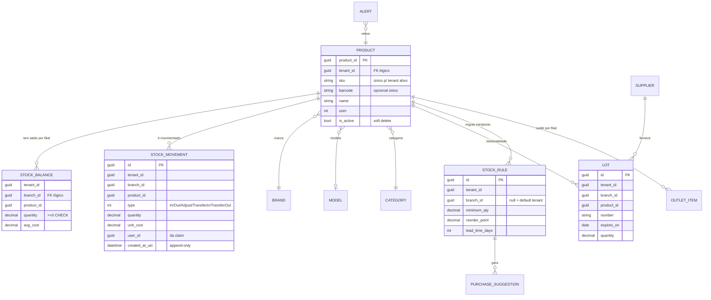
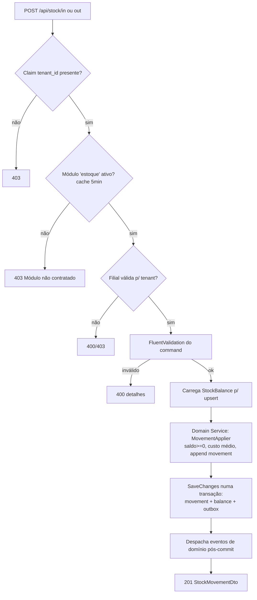

# Etapa 23 — Arquitetura do Microsserviço de Controle de Estoque (design)

**Data:** 22/08/2026
**Status:** Design concluído — aguardando aprovação para implementação

## Objetivo

Projetar o segundo microsserviço da plataforma (**Estoque**), baseado
EXCLUSIVAMENTE nos padrões já adotados pelo microsserviço Identity & Tenants
(auditados na sessão anterior e registrados neste índice). Nenhum código foi
implementado nesta etapa.

## Restrições aceitas

- **NÃO alterar o Identity/Tenant** neste momento (decisão do usuário).
- **Estoque não cria tabela de usuários** — consome a identidade autenticada
  (claims do JWT emitido pelo Identity).
- **Todo dado de negócio vinculado ao Tenant** (`tenant_id` obrigatório).
- **Produto é do TENANT, não da filial**: um produto cadastrado está disponível
  para todas as filiais — **proibido copiar produto por filial**. Saldos,
  movimentações, lotes, regras e outlet são **por filial**.

## Mapeamento dos contextos (pt-BR → código)

A convenção do código é inglês (como `Branch`/`Tenant` no Identity), mensagens
em pt-BR:

| Contexto (usuário) | Código |
|---|---|
| Produtos | `Product` |
| Marcas | `Brand` |
| Modelos | `Model` |
| Categorias | `Category` |
| Fornecedores | `Supplier` |
| Endereços | VO `Address` (de Supplier) |
| Contatos | VO `Contact` (de Supplier) |
| Movimentações | `StockMovement` |
| Regras de estoque | `StockRule` |
| Validade | `Lot` |
| Outlet | `OutletItem` |
| AutoCompra | `PurchaseSuggestion` |
| Importação XML | `XmlImport` |
| Alertas | `Alert` |

## 1. Bounded Contexts

Dentro do serviço de Estoque (um deploy, um banco), cinco contextos delimitados
por namespace e pasta:

```
Catalogo      → Product, Brand, Model, Category, Supplier (+ VOs Address/Contact)
Movimentacoes → StockMovement, StockBalance (saldo por filial)
Politicas     → StockRule, Lot (validade), OutletItem, Alert
AutoCompra    → PurchaseSuggestion (gerado por política/jobs)
Integracao    → XmlImport (importação NF-e XML) + Outbox (eventos de integração)
```

## 2. Aggregates, Entities e Value Objects

### Raízes de agregado (Aggregate Roots)

| Aggregate | Chave | Escopo | Observações |
|---|---|---|---|
| `Product` | `ProductId` | tenant | SKU único **por tenant** entre ativos; referências por id a Brand/Model/Category; unidade de medida; código de barras opcional único por tenant |
| `Brand` | `BrandId` | tenant | nome único por tenant |
| `Model` | `ModelId` | tenant | nome único por (tenant, brand) |
| `Category` | `CategoryId` | tenant | nome único por tenant; hierarquia opcional (`ParentCategoryId`) |
| `Supplier` | `SupplierId` | tenant | documento CPF/CNPJ único por tenant (espelha regra do Tenant do Identity) |
| `StockMovement` | `StockMovementId` | tenant+filial | **imutável** (append-only, log de auditoria); tipos: Entrada/Saida/Ajuste/TransferenciaEntrada/TransferenciaSaida |
| `StockBalance` | — | tenant+filial | identidade natural `(tenant, product, branch)`; quantidade atual; **atualizada apenas por movimentação**, nunca diretamente |
| `StockRule` | `StockRuleId` | tenant(+filial opcional) | estoque mínimo, ponto de pedido, lead time dias; default por produto, override por filial |
| `Lot` | `LotId` | tenant+filial | número do lote + data de validade + quantidade; vínculo com movimentação de entrada |
| `OutletItem` | `OutletItemId` | tenant+filial | marca saldo/produto como outlet com motivo (avaria, devolução, vencimento próximo) e desconto sugerido |
| `PurchaseSuggestion` | `PurchaseSuggestionId` | tenant | gerada pela política de reposição; status Aberta/Aprovada/Descartada |
| `XmlImport` | `XmlImportId` | tenant | máquina de estados: Recebida → Processando → Concluida/Erro(parcial) |
| `Alert` | `AlertId` | tenant | tipo (Ruptura, Excesso, Validade, Outlet), severidade, referência ao recurso, ack do usuário |

### Base comum (copiada do padrão do Identity)

- `Entity<TId>` (igualdade por tipo+id), `ValueObject` (igualdade componencial).
- **IDs tipados** `readonly record struct`: `ProductId`, `BrandId`, `ModelId`,
  `CategoryId`, `SupplierId`, `StockMovementId`, `StockRuleId`, `LotId`,
  `OutletItemId`, `PurchaseSuggestionId`, `XmlImportId`, `AlertId`.
- `TenantId` e `BranchId` são **referências lógicas** (Guid opaco): o Estoque
  **não tem FK física** para o banco do Identity (bancos separados;
  consulta direta proibida pelo contrato §12.1).

### Value Objects

| VO | Conteúdo | Validação |
|---|---|---|
| `Sku` | string normalizada (trim/upper) | obrigatório, tamanho máx |
| `Barcode` | EAN/GTIN-13 | dígitos + check digit |
| `UnitOfMeasure` | enum UN, KG, G, L, ML, CX, M | conversão básica kg/g e l/ml |
| `Quantity` | decimal(18,4) | > 0 para movimentações; ≥ 0 para saldo |
| `Money` | decimal + moeda BRL | ≥ 0; custo médio ponderado |
| `Documento` | TipoPessoa + Cpf/Cnpj | **reutiliza o padrão dos VOs `Cpf`/`Cnpj` do Identity** (cópia das classes puras, sem dependência de projeto) |
| `Email` / `Address` / `Contact` | igual aos VOs do Identity | mesma validação |

## 3. Camadas e Estrutura de Projetos

Nova solução **`Estoque.slnx`** no mesmo formato `.slnx`, espelhando o layout
auditado:

```
src/
├── Estoque.Domain/            # SEM dependências externas
│   ├── Common/                # Entity<TId>, ValueObject, IDs tipados, TenantId/BranchId, exceções de domínio
│   ├── Entities/              # raízes de agregado acima
│   ├── ValueObjects/
│   ├── Enums/                 # MovementType, AlertType, AlertSeverity, SuggestionStatus, ImportStatus, Uom...
│   └── Events/                # eventos de domínio (records imutáveis)
├── Estoque.Application/
│   ├── Catalogo/              # Commands/Queries/Validators/Dtos/IProdutoService, IMarcaService...
│   ├── Movimentacoes/
│   ├── Politicas/             # regras, lotes, outlet, alertas
│   ├── AutoCompra/
│   ├── Integracao/            # XmlImport + outbox
│   ├── IntegrationServices/   # IIdentityApiClient, IModuleAccessChecker, IFilialAccessChecker (interfaces)
│   ├── Common/                # PagedResult<T> (idêntico ao do Identity), Result helpers
│   └── DependencyInjection.cs # AddEstoqueApplication()
├── Estoque.Infrastructure/
│   ├── Persistence/
│   │   ├── EstoqueDbContext.cs        # ApplyConfigurationsFromAssembly
│   │   ├── Configurations/            # IEntityTypeConfiguration por entidade (soft delete filter "Active")
│   │   ├── Migrations/                # Npgsql, Code-First
│   │   ├── Outbox/                    # OutboxMessage + writer/reader
│   │   └── EstoqueDbInitializer.cs    # MigrateAsync na inicialização (padrão IdentitySeeder)
│   ├── Repositories/                  # implementações EF dos repositórios
│   ├── Services/                      # implementações dos IXxxService (transações entre agregados)
│   ├── Identity/                      # IdentityApiClient (HTTP + JWKS), ModuleAccessChecker, FilialAccessChecker + cache
│   ├── Jobs/                          # BackgroundService workers
│   └── DependencyInjection.cs         # AddEstoqueInfrastructure(config)
├── Estoque.Api/
│   ├── Program.cs                     # espelho do Program.cs do Identity
│   ├── Endpoints/                     # Controllers [ApiController] finais (thin)
│   ├── Middleware/CorrelationIdMiddleware.cs
│   ├── OpenApi/                       # BearerSecuritySchemeTransformer, AuthorizeOperationTransformer (cópias)
│   └── appsettings.json / appsettings.Development.json
tests/
└── Estoque.Tests/             # xUnit + Testcontainers Postgres (collection "integration")
Dockerfile                     # multi-stage non-root (padrão Etapa 08)
docker-compose.yml (+override) # rede compartilhada identity-net, portas próprias
.env.example                   # sem segredos (padrão)
docs/CONTRATO-ESTOQUE.md       # contrato da API (padrão CONTRATO-IDENTIDADE.md)
```

## 4. Application Layer — Commands, Queries, Handlers, DTOs

Sem MediatR (consistência com o Identity): **commands/queries são records**
imutáveis e os handlers são os métodos dos serviços de aplicação
(`IXxxService`). FluentValidation valida cada command/query.

Exemplos (convenção `Criar/Listar/…` em português nos casos, nomes de classe em
inglês):

| Handler (método) | Command/Query | Saída |
|---|---|---|
| `ProductService.CreateAsync` | `CreateProductCommand(TenantId, Sku, Name, Barcode?, BrandId?, ModelId?, CategoryId?, UnitOfMeasure)` | `ProductDto` |
| `ProductService.ListAsync` | `ListProductsQuery(TenantId, ?search, ?categoryId, ?brandId, page, pageSize)` | `PagedResult<ProductDto>` |
| `StockMovementService.RegisterInAsync` | `RegisterStockInCommand(TenantId, BranchId, ProductId, Quantity, UnitCost?, LotInfo?, OriginDocumentRef?)` | `StockMovementDto` + saldo atualizado |
| `StockMovementService.TransferAsync` | `TransferStockCommand(TenantId, FromBranchId, ToBranchId, ProductId, Quantity)` | 2 movimentações atômicas |
| `StockBalanceService.ListByBranchAsync` | `ListBalancesQuery(TenantId, BranchId, ?belowMinimum)` | `PagedResult<StockBalanceDto>` |
| `StockRuleService.SetAsync` | `SetStockRuleCommand(TenantId, ProductId, BranchId?, MinimumQty, ReorderPoint, LeadTimeDays?)` | `StockRuleDto` |
| `LotService.RegisterAsync / ListExpiringAsync` | `RegisterLotCommand(...)`, `ListExpiringLotsQuery(TenantId, BranchId, days)` | `LotDto[]` |
| `OutletItemService.MarkAsync` | `MarkOutletCommand(TenantId, BranchId, ProductId, Reason, SuggestedDiscountPct?)` | `OutletDto` |
| `PurchaseSuggestionService.GenerateForTenantAsync` | job interno | cria sugestões + alertas |
| `XmlImportService.EnqueueAsync / GetStatusAsync` | multipart upload → `EnqueueXmlImportCommand` | `XmlImportDto` (status polling) |
| `AlertService.ListAsync / AcknowledgeAsync` | `ListAlertsQuery(...)`, `AcknowledgeAlertCommand(...)` | `AlertDto[]` |

**DTOs**: records planos (`ProductDto`, `StockMovementDto`,
`StockBalanceDto`, `StockRuleDto`, `LotDto`, `OutletDto`,
`PurchaseSuggestionDto`, `XmlImportDto`, `AlertDto`) — mesmo estilo
`TenantDto`/`BranchDto`.

## 5. Repositories

Interfaces na **Application**, implementações EF na **Infrastructure**
(DIP/SOLID; evolução consciente sobre o padrão "service acessa DbContext
direto" do Identity — justificativa: invariantes transacionais mais ricas no
Estoque exigem teste de unidade do domínio sem EF):

```
IProdutoReadRepository / IProdutoWriteRepository (agregado Product)
IBrandRepository, IModelRepository, ICategoryRepository, ISupplierRepository
IStockMovementRepository (append-only + paginação)
IStockBalanceRepository (upsert concorrente protegido)
IStockRuleRepository, ILotRepository, IOutletRepository
IPurchaseSuggestionRepository, IXmlImportRepository, IAlertRepository
IOutboxWriter / IOutboxReader
```

## 6. Domain Services

| Serviço | Responsabilidade |
|---|---|
| `MovementApplier` | aplica uma movimentação ao `StockBalance` garantindo invariante **saldo ≥ 0** (exceto Ajuste negativo autorizado por regra) e calcula custo médio ponderado |
| `ReplenishmentPolicy` | compara saldo vs `StockRule` (mínimo/ponto de pedido) → gera `Alert` (ruptura/excesso) e `PurchaseSuggestion` (AutoCompra) |
| `ExpiryPolicy` | varre `Lot`s por janela de validade → `Alert` de validade + sugestão de Outlet |
| `XmlImportProcessor` | parse/valida NF-e XML → movimentações de entrada em lote (transação por arquivo) |

## 7. API — Controllers/Endpoints (REST)

Convenções do Identity mantidas: `[ApiController]`, rotas `api/…`,
ProblemDetails, 400 validação/regra, 404 payload `{title}`, 403 tenant/role.

| Rota | Métodos | Roles (escopo tenant) |
|---|---|---|
| `/api/products` (+`/{id}`) | GET, POST, PUT, DELETE(soft) | leitura: qualquer role do tenant; escrita: TenantAdmin, Manager |
| `/api/brands`, `/api/models`, `/api/categories` | CRUD leve | escrita: TenantAdmin, Manager |
| `/api/suppliers` | CRUD | escrita: TenantAdmin, Manager |
| `/api/stock/in`, `/api/stock/out`, `/api/stock/adjustments` | POST | Manager, Seller (ajuste: Manager+) |
| `/api/stock/transfers` | POST | Manager+ |
| `/api/balances` | GET (`?branchId=`, `?belowMinimum=true`) | qualquer role do tenant |
| `/api/stock-rules` | PUT/GET | TenantAdmin, Manager |
| `/api/lots`, `/api/lots/expiring?days=` | POST/GET | Manager+, leitura geral |
| `/api/outlet-items` | POST/DELETE/GET | Manager, Seller |
| `/api/purchase-suggestions` | GET/PATCH(status) | TenantAdmin, Manager |
| `/api/xml-imports` | POST(multipart)/GET status | TenantAdmin, Manager |
| `/api/alerts` | GET/PATCH ack | leitura geral; ack Manager+ |
| `/api/health` | GET | público (healthcheck compose) |
| `/metrics` | GET | Prometheus (padrão Etapa 07) |

## 8. Integração com o Identity (sem alterá-lo)

1. **Autenticação**: JwtBearer RS256 — validação via **JWKS público**
   (`GET {IDENTITY_BASE_URL}/api/auth/jwks`) usando `IssuerSigningKeyResolver`
   com cache da chave; `ValidIssuer`/`ValidAudience` alinhados às env vars
   canônicas compartilhadas (`JWT_ISSUER`, `JWT_AUDIENCE` — corrige o Risco #2
   do relatório de auditoria).
2. **Identidade do usuário**: claims `user_id`, `tenant_id`, `role`
   (constantes espelhadas de `JwtClaims`). Controllers extraem via
   `User.FindFirstValue(...)` e injetam nos commands via `with {}` — **nunca**
   confiam em ids do body/rota para tenant (padrão auditado §E/F).
3. **Gate de módulo**: policy customizada `module-estoque` que chama
   `GET /api/tenants/me/modules` com o token do próprio usuário e verifica
   slug `estoque` ativo — resultado em cache (IMemoryCache/Valkey, TTL 5 min);
   falha ⇒ 403 "Módulo Estoque não contratado". Consulta direta ao banco do
   Identity permanece **proibida** (contrato §12.1).
4. **Validação de filial** (ver estratégia abaixo): chamada HTTP com token do
   usuário + cache curto.

```mermaid
sequenceDiagram
    participant FE as Frontend/SPA
    participant ES as Estoque.Api
    participant ID as Identity.Api
    FE->>ES: GET /api/balances?branchId=X<br/>Authorization: Bearer JWT(tenant_id, user_id, role)
    ES->>ES: JwtBearer valida assinatura<br/>(JWKS do Identity, cache da chave)
    ES->>ES: Policy "tenant": exige claim tenant_id
    ES->>ID: GET /api/tenants/me/modules<br/>(token encaminhado; cache 5 min)
    ID-->>ES: 200 [{slug:"estoque", plan:"Essencial"}]
    ES->>ID: GET /api/tenants/me/branches (valida filial X ∈ tenant; cache)
    ID-->>ES: 200 [...]
    ES->>ES: Query escopada por (tenant_id, branch_id)
    ES-->>FE: 200 PagedResult<StockBalanceDto>
```

## 9. Estratégia de TenantId

- Claim `tenant_id` do JWT é a **única fonte de verdade** (padrão
  `MyTenantModulesController`).
- Toda rota de negócio exige a claim ⇒ **SuperAdmin global (sem claim) não
  opera Estoque** na v1 (403 com mensagem clara) — evita impersonation e
  vazamento entre tenants.
- Persistência: coluna `tenant_id` em **todas** as tabelas de negócio +
  **todos os índices iniciam por tenant_id**; queries sempre escopadas.
- Unicidades são **por tenant** (índices únicos compostos/parciais, padrão
  Etapas 04/12/13): `(tenant_id, sku) WHERE is_active`,
  `(tenant_id, barcode) WHERE is_active`, `(tenant_id, name)` em marcas/
  categorias/modelos, `(tenant_id, document_number)` em fornecedores.

## 10. Estratégia de FilialId (multi-filial)

- **Produto NÃO tem filial** (regra do usuário): catálogo é do tenant.
- **Filial entra apenas nos contextos operacionais**: saldos, movimentações,
  lotes, outlet, regras por filial, transferências.
- Chegada do FilialId: parâmetro de rota/query/body (`branchId:guid`),
  **formato Guid validado**; contexto "minha filial" via header opcional
  `X-Filial-Id` (default da UI).
- **Validação de posse** (filial pertence ao tenant do token): `IFilialAccessChecker`
  chama o Identity com o token do usuário (endpoint `branches` já existente
  para TenantAdmin/SuperAdmin) com cache 5 min.
  - **Limitação v1 honesta:** roles operacionais (Seller/Delivery/Manager) hoje
    recebem 403 no endpoint de branches do Identity. Enquanto o Identity não
    expõe `GET /api/tenants/me/branches` para qualquer role com claim (mesmo
    padrão do `me/modules`, Etapa 20), o Estoque aplica: (a) validação dura
    quando a role permite; (b) caso contrário aceita o Guid **escopando toda
    escrita/leitura por tenant_id** — risco residual de troca de filial dentro
    do MESMO tenant, registrado como pendência (baixa severidade: dado do
    próprio tenant).
- Transferência entre filiais = **uma única transação** com duas movimentações
  espelhadas (`TransferenciaSaida`/`TransferenciaEntrada`) — atomicidade no
  `MovementApplier`.

## 11. Eventos de Domínio (in-process)

Records imutáveis em `Estoque.Domain.Events`, despachados **pós-commit**
(coletados nos agregados, publicados após SaveChanges com sucesso):

- `ProductCreated(ProductId, TenantId, Sku)`
- `ProductSoftDeleted(ProductId, TenantId)`
- `StockMovementRegistered(StockMovementId, TenantId, BranchId, ProductId, Type, Quantity)`
- `StockBalanceChanged(TenantId, BranchId, ProductId, NewQuantity)`
- `LowStockDetected(TenantId, BranchId, ProductId, Quantity, MinimumQty)`
- `LotNearExpiry(LotId, TenantId, BranchId, ProductId, ExpiresOnUtc)`
- `OutletMarked(OutletItemId, ...)`
- `PurchaseSuggestionCreated(PurchaseSuggestionId, ...)`

Consumidores internos: geradores de `Alert` (contexto Politicas) — desacoplamento
entre contextos dentro do serviço, **sem broker**.

## 12. Eventos de Integração (Outbox)

Sem message broker na stack atual (Postgres + Valkey apenas). Decisão:
**Transactional Outbox** — tabela `outbox_messages(id, occurred_at_utc, type,
payload jsonb, published_at_utc NULL)` escrita na MESMA transação do negócio;
worker `OutboxDispatcherWorker` marca como publicado. Consumidores futuros
(Vendas/Faturamento) podem ler via polling até um broker ser introduzido
(RabbitMQ/MassTransit fica como evolução registrada, não implementada agora).

Eventos de integração previstos: `estoque.produto.criado/atualizado/inativado`,
`estoque.movimentacao.registrada`, `estoque.saldo.alterado`,
`estoque.alerta.gerado`.

**Entrada de integração**: nenhum evento inbound na v1 (o Identity não publica
eventos; integração é síncrona HTTP/JWT conforme contrato vigente).

## 13. Background Jobs (BackgroundService nativo, sem Hangfire)

| Worker | Cadastro | Função |
|---|---|---|
| `ExpiryScanWorker` | diária (config) | varre lotes → eventos `LotNearExpiry` → alertas |
| `ReplenishmentScanWorker` | horária | aplica `ReplenishmentPolicy` por tenant/filial → alertas ruptura/excesso + sugestões AutoCompra |
| `XmlImportWorker` | contínua (polling fila interna) | processa importações pendentes (status machine) |
| `OutboxDispatcherWorker` | 30 s | publica/despacha outbox pendente |

Todos idempotentes, com Serilog + CorrelationId, tolerantes a falha (try/catch
por item, backoff simples) — sem dependências novas.

## 14. Tratamento de Exceções

- Contrato idêntico ao Identity: `ProblemDetails`; `ValidationException` → 400
  com detalhes; `BusinessRuleViolationException` → 400; inexistente → 404
  `{title}`; tenant/role → 403.
- **Melhoria adotada desde o início** (mitiga Risco #3 da auditoria):
  `IExceptionHandler` global (.NET) registrando 500 → `ProblemDetails` com
  `traceId`/CorrelationId, **mantendo** o try/catch fino nas actions para os
  erros de negócio (consistência visual com o Identity).

## 15. Validações (3 camadas, padrão Identity)

1. **FluentValidation** por command/query (DTOs como contracts, sem MediatR);
2. **Invariantes de domínio** nas entidades/VOs (`SetXxx` lançando
   `ArgumentException`/`BusinessRuleViolationException` — padrão
   `Branch.SetName`);
3. **Banco como última defesa**: unicidade por índices únicos compostos/parciais
   (`WHERE is_active`), `CHECK quantity >= 0` em saldos — violações capturadas
   viram 400/409 (padrão Etapa 04 + contrato §13).

## 16. Banco de Dados (PostgreSQL próprio)

Instância/container `estoque_postgres`, database `estoque` — **database-per-service**.
Migrations Npgsql aplicadas automaticamente na inicialização
(`EstoqueDbInitializer.MigrateAsync`, espelhando `IdentitySeeder`).

Tabelas principais: `products`, `brands`, `models`, `categories`,
`suppliers`, `stock_movements` (append-only), `stock_balances`,
`stock_rules`, `lots`, `outlet_items`, `purchase_suggestions`, `xml_imports`,
`alerts`, `outbox_messages`. Todas as tabelas de negócio com `tenant_id`
indexado em primeiro lugar.

## 17. Docker / Configuração

- `Dockerfile` multi-stage non-root (cópia do padrão Etapa 08).
- Compose adiciona `estoque_api` (:8081) e `estoque_postgres`, ambos na rede
  `identity-net` (external network compartilhada) para alcançar
  `identity_api` por DNS interno; healthchecks iguais aos existentes.
- Env vars: `IDENTITY__BASE_URL`, `Jwt__Issuer/Audience` (canônicos
  compartilhados), `ConnectionStrings__DefaultConnection`, rate limiting e
  Serilog idênticos ao Identity. Segredos só via `.env`/env (nunca commitados).

## 18. Testes

xUnit + Testcontainers Postgres real (fixture compartilhada na collection
`"integration"` — padrão Etapa 09). Tokens de teste emitidos com chave RSA da
própria fixture configurando o JwtBearer (JWKS apontando para a fixture).
Suíte executável via `scripts/run-tests-in-docker.ps1` equivalente (contorna
Smart App Control — lição da Etapa 20/21).

## Diagrama — Bounded Contexts e Context Map

```mermaid
flowchart LR
    subgraph ID["Identity.Api (EXISTENTE — intocado)"]
        AUTH[Auth/JWT RS256]
        JWKS[JWKS /api/auth/jwks]
        MOD[GET /tenants/me/modules]
        BR[GET /tenants/{id}/branches]
    end

    subgraph EST["Estoque.Api"]
        subgraph BC1["Catálogo"]
            PR[Product] --- BRD[Brand/Model/Category] --- SUP[Supplier]
        end
        subgraph BC2["Movimentações"]
            MV[StockMovement] --> SB[StockBalance]
        end
        subgraph BC3["Políticas"]
            RL[StockRule] --- LT[Lot] --- OL[OutletItem] --- AL[Alert]
        end
        subgraph BC4["AutoCompra"]
            PS[PurchaseSuggestion]
        end
        subgraph BC5["Integração"]
            XI[XmlImport]
            OB[(Outbox)]
        end
    end

    DB[(estoque_postgres)]

    FE[Frontend/SPA]

    FE -->|"Bearer JWT"| ES
    ES -->|"valida assinatura"| JWKS
    ES -->|"gate módulo estoque"| MOD
    ES -->|"valida filial"| BR
    BC1 & BC2 & BC3 & BC4 & BC5 --> DB
    OB -.->|"futuros consumidores"| OTHERS[Próximos microsserviços]
```

## Diagrama — Agregados principais



## Diagrama — Fluxo de movimentação (invariantes)



## Decisões técnicas e por quê

- **Mesmo layout de solução/linhas de DI** (`AddEstoqueApplication()` /
  `AddEstoqueInfrastructure(config)`) — consistência total com o Identity.
- **Repositórios explícitos** (diferença consciente): o Identity usa services
  sobre DbContext direto; o Estoque introduz `IXxxRepository` porque as
  invariantes (saldo ≥ 0, custo médio, transferência atômica) pedem testes de
  domínio isolados de EF.
- **Outbox em vez de broker** — nenhuma infra nova; evolução para RabbitMQ
  registrada como pendência futura.
- **SuperAdmin sem acesso ao Estoque v1** — simplifica autorização e evita
  impersonation; reavaliar quando houver administração cross-tenant.
- **Gate de módulo por policy + cache** — segue o contrato §12.2 à risca.

## Arquivos criados

- `docs/memoria/etapa-23-arquitetura-microservico-estoque.md` (este arquivo)
- `docs/memoria/INDEX.md` (linha da etapa 23 + pendências)

## Pendências / Próximos passos (pós-aprovação)

1. Implementar estrutura de projetos + Docker + JWT/JWKS + health checks
   (esqueleto funcional).
2. Implementar contexto Catálogo (CRUDs + soft delete + unicidade por tenant).
3. Implementar Movimentações/Saldos (MovementApplier + transferência atômica).
4. Implementar Políticas (regras, lotes, outlet, alertas) + jobs.
5. AutoCompra + Importação XML.
6. Suíte de testes Testcontainers + `run-tests-in-docker.ps1`.
7. `docs/CONTRATO-ESTOQUE.md`.
8. **Dependente do Identity (adição futura, não alteração)**:
   `GET /api/tenants/me/branches` para endurecer a validação de filial para
   roles operacionais (pendência registrada também no índice).
